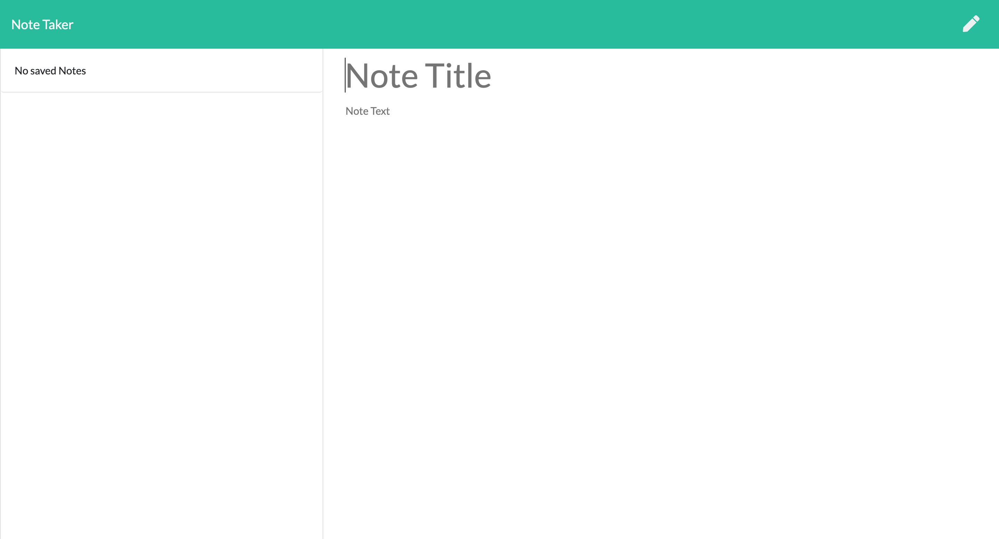
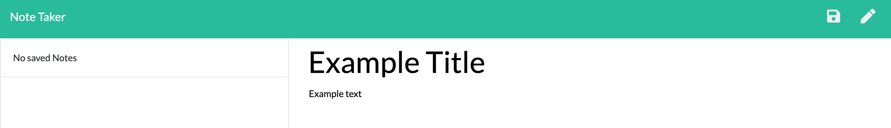

# Note Taker
            
This application is designed with Express to create store and delte notes. 
  
## Table of Contents
1. Installation
1. Usage

  
## Installation
You will need to input "npm install" in the terminal to install all the necessary node modules.
  
## Usage
On the notes page, write a title and note content. 

Then the save button will appear. When you save, your note will be on the left. 

You can delete the note if you no longer need it with the trashcan icon.

  